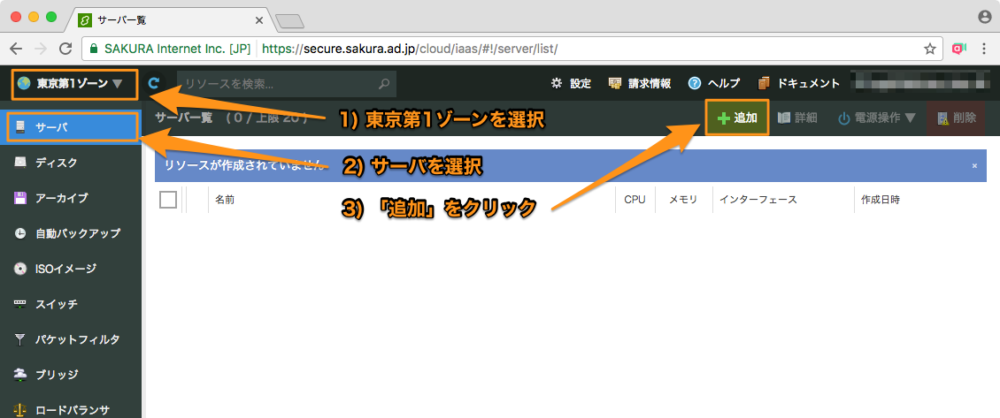

# 作業用サーバの構築

さくらのクラウド上に作業用サーバ(CentOS7)を作成し、ハンズオン実行環境を構築します。

  - [サーバ(CentOS7)を作成](#p01)
  - [さくらのクラウド APIキーの取得](#p02)
  - [ハンズオン実行環境のセットアップ](#p03)

<a id="p01"></a>
## サーバ(CentOS7)を作成

1) さくらのクラウドのコントロールパネルにログインします。

    [さくらのクラウド コントロールパネル](https://secure.sakura.ad.jp/cloud/)

ユーザーコード、会員ID、パスワードを入力してログインします。


2) サーバー作成画面を開きます。

- ログイン後、さくらのクラウド(IaaS)を選択
- 東京第1ゾーンを選択し、サーバ追加画面を開く




3) サーバー作成画面で作業用サーバ(CentOS7)を作成します。

- 右上の「シンプルモード」がチェックされていない場合、チェックする
- ディスクイメージとして「CentOS7」を選択
- 画面を下にスクロールし、管理ユーザのパスワードを入力(任意の値)
- ホスト名に「terraform」と入力
- 作成ボタンをクリック


<a id="p02"></a>
## さくらのクラウド APIキーの取得 & 設定

まだサーバ作成中で、以下の画面が表示されている場合は閉じるボタンをクリックします。  
(バックグラウンドで処理され続けます)


左上の「設定」を選択し、APIキー作成画面を開きます。


APIキーを作成し、`ACCESS TOKEN`(アクセストークン)と`ACCESS TOKEN SECRET`(アクセストークンシークレット)をコピーし、手元のエディタなどに控えておきます。


<a id="p03"></a>
## ハンズオン実行環境のセットアップ

### 1) TerraformとTerraform for さくらのクラウドのセットアップ

1. サーバに SSH で接続（ログイン用IDは `root` ）
```bash
    $ ssh -l root <IPアドレス>
```
2. 作業用アカウント `terraform` の作成
```bash
    # adduser terraform
```
3. ユーザの切り替え
```bash
    # su - terraform
```
4. ハンズオン環境一式をダウンロード
```bash
    $ git clone https://github.com/sacloud/terraform-hands-on.git
```
5. ディレクトリを移動し、Terraform セットアップ用スクリプトを実行（Terraform 本体と、Terraform for さくらのクラウドをセットアップ）
```bash
    $ cd terraform-hands-on
    $ sh ./terraform-setup.sh
```
6. Terraform の動作確認（バージョン情報の表示）
```bash
    $ terraform version
    Terraform v0.9.3
```

### 2) 環境変数の設定

Terraform を操作する前に、さくらのクラウドの API トークンを環境変数に設定します。
設定対象は以下の３つです。

* `SAKURACLOUD_ACCESS_TOKEN` … アクセス・トークンの文字列
* `SAKURACLOUD_ACCESS_TOKEN_SECRET` … アクセス・トークン・シークレットの文字列
* `SAKURACLOUD_ZONE` … 操作対象のゾーン指定
  * `is1b` … 石狩第2ゾーン
  * `tk1a` … 東京第1ゾーン
  * `tk1v` … サンドボックス

コマンドをシェルの履歴に残らないようにするには、次のように実行し、遺したくないコマンドの前に `空白スペース` を入れます。
```
HISTCONTROL=ignorespace
```
そして、環境変数を設定します。
```
 export SAKURACLOUD_ACCESS_TOKEN=<文字列>
 export SAKURACLOUD_ACCESS_TOKEN_SECRET=<文字列>
 export SAKURACLOUD_ZONE=is1b
```

### 3) SSH 鍵ペアの作成

`terraform` アカウントで、作成した仮想サーバにログインするための鍵ペアを作成します。
途中で、ファイル作成先パスとパスフレーズの入力を求められますが、今回は空のままにしてください。

```bash
$ ssh-keygen -t rsa
Enter file in which to save the key (/home/terraform/.ssh/id_rsa):  # そのままEnterを押す
Enter passphrase (empty for no passphrase): # そのままEnterを押す
Enter same passphrase again: # そのままEnterを押す
```

<a id="hands_on"></a>
# ハンズオンの進め方

## 実行方法

各ハンズオンのディレクトリ内にサンプルの Terraform 用設定ファイル `.tf` があります。  
各ディレクトリ内で `terraform plan` → `terraform apply` を実行し、リソースを作成します。  

各ハンズオンのディレクトリは[トップページの目次](../README.md)を参照してください。

## リソースの削除の仕方

各ディレクトリ内で `terraform destroy` を入力し、確認プロンプトで `yes` を入力します。あとは、Terraform が自動的にリソースを削除します。

