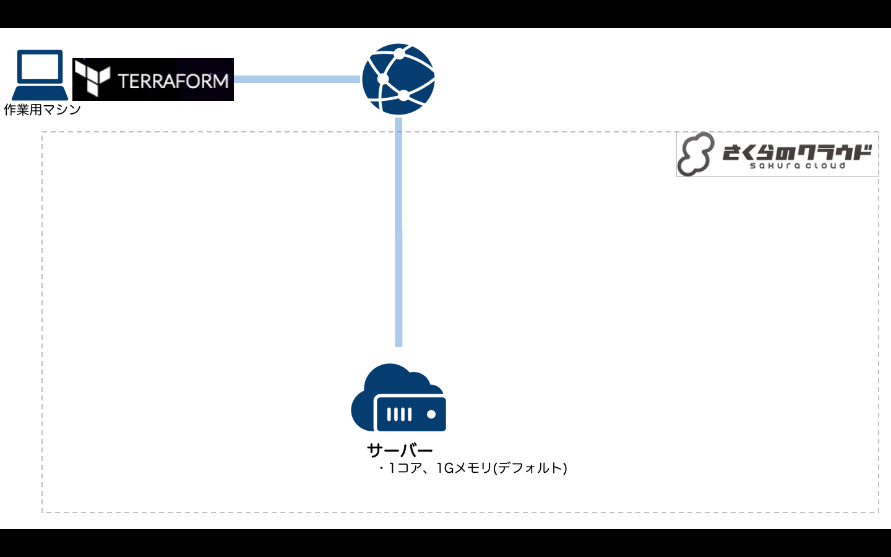

# Terraform for さくらのクラウド ハンズオン

## 基本編01: 空(ディスクレス)のサーバを作成 

最もシンプルな構成です。



### 解説

空(ディスクレス)のサーバを作成しています。  
デフォルトでインターネットに接続されたNICが1つ付属しています。  

## コマンド

* `terraform plan` … 確認
* `terraform apply` … 反映
* `terraform show` … 詳細情報の表示
* `terraform destroy` … 環境の破棄
```
$ terraform destroy
Do you really want to destroy?
  Terraform will delete all your managed infrastructure.
  There is no undo. Only 'yes' will be accepted to confirm.

  Enter a value: yes	←入力

data.sakuracloud_archive.centos: Refreshing state...
(snip)
Destroy complete! Resources: 4 destroyed.
```

## 参考資料

- [Terraform for さくらのクラウド:リファレンス - サーバ](https://sacloud.github.io/terraform-provider-sakuracloud/configuration/resources/server/)

---

Next: [基本編02:ディスクの作成〜サーバとの接続](../02_create_disk)