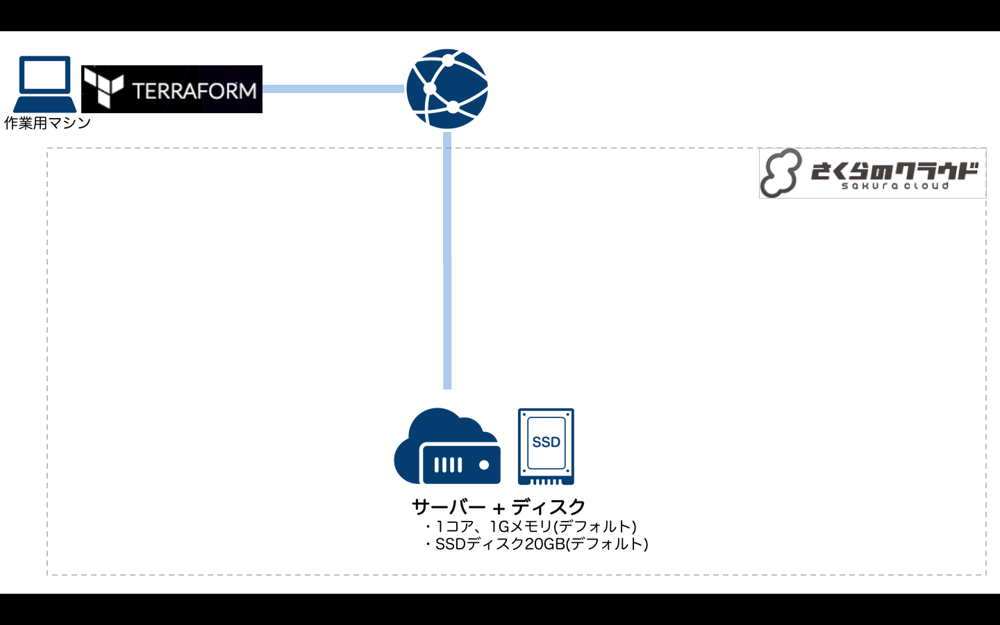

# Terraform for さくらのクラウド ハンズオン

## 基本編02: ディスクの作成〜サーバとの接続

ディスクを作成し、サーバと接続します。

### 解説

ディスクを作成し、サーバと接続します。
この段階ではまだディスクにOSがインストールされていません。

## コマンド

* `terraform plan` … 確認
* `terraform apply` … 反映
* `terraform show` … 詳細情報の表示
* `terraform destroy` … 環境の破棄

## 参考資料

- [Terraform for さくらのクラウド:リファレンス - サーバ](https://yamamoto-febc.github.io/terraform-provider-sakuracloud/configuration/resources/server/)
- [Terraform for さくらのクラウド:リファレンス - ディスク](https://yamamoto-febc.github.io/terraform-provider-sakuracloud/configuration/resources/disk/)

---

Next: [基本編03:OSのインストール](../03_install_os)