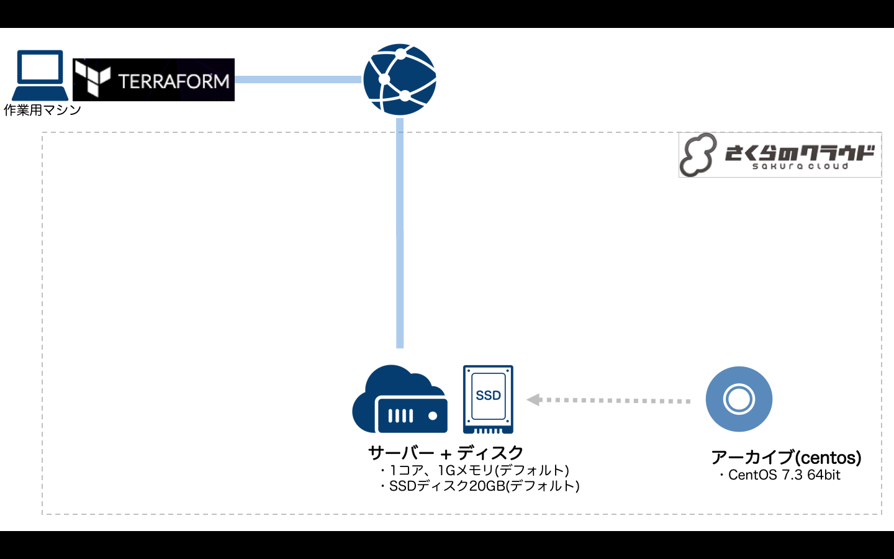

# Terraform for さくらのクラウド ハンズオン

## 基本編03: OSのインストール

さくらのクラウドで提供されているアーカイブ(OSテンプレートみたいなもの)を利用してCentOS7がインストールされたディスクを作成します。



### 解説

ディスクの定義時にコピー元となるアーカイブのIDを指定しています。

```hcl
 # パブリックアーカイブ(OSテンプレート)を指定
    source_archive_id = 112900084256 # 石狩第2ゾーンのCentOS7
```

ここではアーカイブのIDをtfファイル上に直接記載しています。  
このIDは今後のさくらのクラウド側のアップデートなどで変更となる場合がありますのでご注意下さい。

## コマンド

* `terraform plan` … 確認
* `terraform apply` … 反映
* `terraform show` … 詳細情報の表示
* `terraform destroy` … 環境の破棄


## 参考資料

- [Terraform for さくらのクラウド:リファレンス - サーバ](https://yamamoto-febc.github.io/terraform-provider-sakuracloud/configuration/resources/server/)
- [Terraform for さくらのクラウド:リファレンス - ディスク](https://yamamoto-febc.github.io/terraform-provider-sakuracloud/configuration/resources/disk/)

---

Next: [基本編04:データソースの利用](../04_use_data_source)