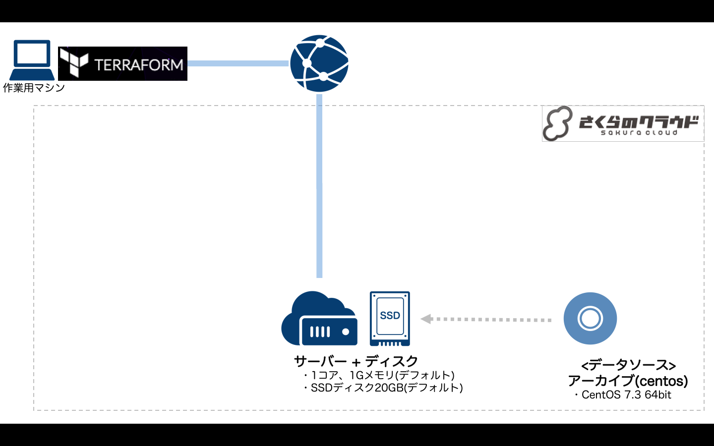

# Terraform for さくらのクラウド ハンズオン

## 基本編04: データソースの利用 

Terraform for さくらのクラウドでデータソースを利用して、動的な値の参照を行います。



### 解説

アーカイブのIDをtfファイルに直接記載する代わりにデータソースを利用するようにしています。

```hcl
# データソース(アーカイブ)の定義
data sakuracloud_archive "centos" {
    os_type = "centos"
}

# ディスクの定義
resource sakuracloud_disk "disk" {
    // [...]

    # パブリックアーカイブ(OSテンプレート)を指定
    source_archive_id = "${data.sakuracloud_archive.centos.id}" #データソース"centos"のidを指定

    // [...]
}
```

#### データソースとは

データソースとは、特定の条件を指定してリソースを参照するための機能です。  

```hcl
# データソース(アーカイブ)の定義
data sakuracloud_archive "centos" {
    os_type = "centos"
}
```

#### 動的に値を処理する`${}`記法

`${}`という記法は、Terraformで動的な値を処理するために利用します。  
他のリソースの値を利用したり、Terraformに組み込まれている関数を利用する場合に用います。

```hcl
# 他のリソースの値を参照する場合(${リソースタイプ.リソースID.属性名})
    ${sakuracloud_server.server.id} # サーバリソースの"server"というIDを持つリソースの"id"属性を参照
    
# データソースの値を利用する場合(${data.リソースタイプ.リソースID.属性名}) - 先頭に"data."をつける
    ${data.sakuracloud_archive.centos.id} # アーカイブリソースの"centos"というIDを持つリソースの"id"属性を参照

# 変数を利用する場合(変数は基本編08で登場します)
    ${var.変数名}

# 関数を利用する場合
    ${format("%02d", count.index)}
```

## コマンド

* `terraform plan` … 確認
* `terraform apply` … 反映
* `terraform show` … 詳細情報の表示
* `terraform destroy` … 環境の破棄

## 参考資料

- [Terraform for さくらのクラウド:リファレンス - サーバ](https://yamamoto-febc.github.io/terraform-provider-sakuracloud/configuration/resources/server/)
- [Terraform for さくらのクラウド:リファレンス - ディスク](https://yamamoto-febc.github.io/terraform-provider-sakuracloud/configuration/resources/disk/)
- [Terraform for さくらのクラウド:リファレンス - データソース](https://yamamoto-febc.github.io/terraform-provider-sakuracloud/configuration/resources/data_resource/)

---

Next: [基本編05:SSH公開鍵認証の導入](../05_use_ssh_key)