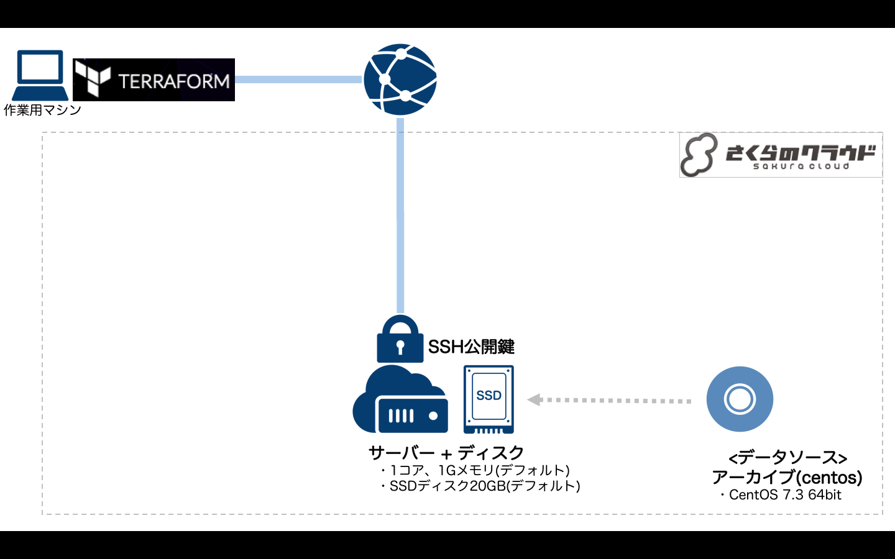

# Terraform for さくらのクラウド ハンズオン

## 基本編05: SSH公開鍵認証の導入 

サーバへのSSH接続時に公開鍵認証を行うように設定します。



### 解説

さくらのクラウド上に公開鍵を登録し、サーバへのSSH接続時に公開鍵を利用して認証を行うように設定します。  
同時にSSH接続時のパスワード/チャレンジレスポンス認証を無効にしています。

```hcl
# SSH公開鍵の定義
resource sakuracloud_ssh_key "key" {
    name = "key"
    # file()関数で公開鍵を読み込む
    public_key = "${file("~/.ssh/id_rsa.pub")}"
}
```

`${file(ファイルパス)}`関数を用いてアップロードする公開鍵を読み込んでいます。

#### サーバへのSSH接続

サーバのグローバルIPを表示するためにアウトプット`server_ip`を定義しています。  
以下のコマンドでサーバのグローバルIPを表示できます。

```bash
terraform output server_ip
```

サーバのIPアドレスを確認したら、以下コマンドでサーバにSSH接続を行います。

```bash
ssh root@[サーバのIPアドレス] 
```

デフォルトの秘密鍵(~/.ssh/id_rsa)を用いてSSH接続しています。

## コマンド

* `terraform plan` … 確認
* `terraform apply` … 反映
* `terraform show` … 詳細情報の表示
* `terraform output` … サーバのIPアドレス表示(定義した`output`の表示)
* `terraform destroy` … 環境の破棄


## 参考資料

- [Terraform for さくらのクラウド:リファレンス - サーバ](https://sacloud.github.io/terraform-provider-sakuracloud/configuration/resources/server/)
- [Terraform for さくらのクラウド:リファレンス - ディスク](https://sacloud.github.io/terraform-provider-sakuracloud/configuration/resources/disk/)
- [Terraform for さくらのクラウド:リファレンス - 公開鍵](https://sacloud.github.io/terraform-provider-sakuracloud/configuration/resources/ssh_key/)
- [Terraform for さくらのクラウド:リファレンス - データソース](https://sacloud.github.io/terraform-provider-sakuracloud/configuration/resources/data_resource/)
- [Terraform 組み込み関数](https://www.terraform.io/docs/configuration/interpolation.html#built-in-functions)

---

Next: [基本編06:プロビジョニング(SSH編)](../06_provisioning_ssh)
