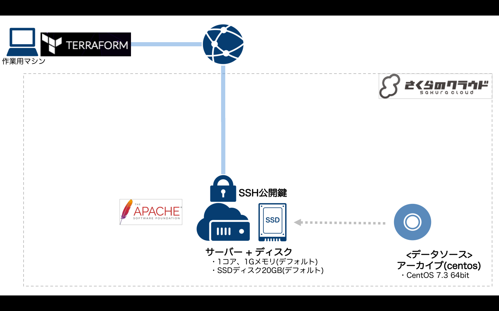

# Terraform for さくらのクラウド ハンズオン

## 基本編08: 変数の利用(変数 + tfvarsファイル)

変数を利用することで、tfファイルの再利用性を向上させます。

### 解説

[variables.tf](variables.tf)にて変数の定義を行なっています。

変数に値を投入する方法としては以下の4つがあります。
  
  - コマンドライン上で対話的に設定
  - コマンドライン上で”-var”フラグ指定
  - tfvarsファイルで設定
  - 環境変数で設定

詳細は以下のページを参照ください。

[Terraform for さくらのクラウド スタートガイド （第二回） ～便利なビルトイン機能～](http://knowledge.sakura.ad.jp/knowledge/7550/)

今回はtfvarsファイルを用いています。

## コマンド

* `terraform plan` … 確認
* `terraform apply` … 反映
* `terraform show` … 詳細情報の表示
* `terraform output` … サーバのIPアドレス表示(定義した`output`の表示)
* `terraform destroy` … 環境の破棄

## 参考資料

- [Terraform for さくらのクラウド:リファレンス - サーバ](https://sacloud.github.io/terraform-provider-sakuracloud/configuration/resources/server/)
- [Terraform for さくらのクラウド:リファレンス - ディスク](https://sacloud.github.io/terraform-provider-sakuracloud/configuration/resources/disk/)
- [Terraform for さくらのクラウド:リファレンス - 公開鍵](https://sacloud.github.io/terraform-provider-sakuracloud/configuration/resources/ssh_key/)
- [Terraform for さくらのクラウド:リファレンス - データソース](https://sacloud.github.io/terraform-provider-sakuracloud/configuration/resources/data_resource/)

---

Next: [応用リソース(サービス)編](../../02_service_item/)