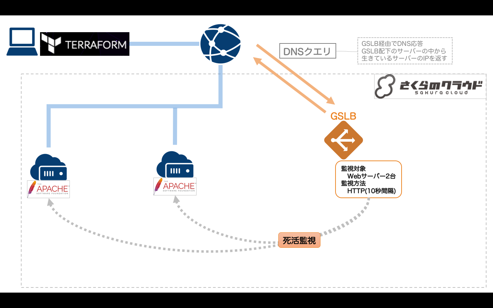

# Terraform for さくらのクラウド ハンズオン

## 応用リソース(サービス)編03: GSLB

GSLB(広域負荷分散)機能を提供します。  

参考: [さくらのクラウド GSLB](http://cloud-news.sakura.ad.jp/gslb/)



## 解説/ポイント

同じ構成のサーバ/ディスクを2台作成するために`count`属性を利用しています。

```hcl
resource sakuracloud_server "servers" {
    # count属性で作成数を指定する
    count = "${var.server_count}"
    
    # count.indexで自身のインデックスを参照できる。(インデックスは0開始)
    # ここではformat()関数と組み合わせて利用している。
    name = "${var.server_name}-${format("%02d",count.index + 1)}"

    // [...]
}
```

## 動作確認

`terraform output gslb_fqdn`を実行すると、GSLBに割り当てられたFQDNが表示されます。

FQDNを確認し、以下URLをブラウザで開いてください。

    http://[表示したFQDN]

GSLB配下のサーバから応答されます。  

## DNSキャッシュのクリア(chromeのみ)

通常、ブラウザはDNSキャッシュを持っていますので、リロードしても応答するサーバが変わらないことがあります。  
この場合、以下の手順でDNSキャッシュをクリアすることで、GSLBが応答した別のサーバに接続することが可能です。

以下ページを開き、`Clear host cache`ボタンをクリック

> [chrome://net-internals/#dns](chrome://net-internals/#dns)

## コマンド

* `terraform plan` … 確認
* `terraform apply` … 反映
* `terraform show` … 詳細情報の表示
* `terraform destroy` … 環境の破棄

## 参考資料

- [Terraform for さくらのクラウド:リファレンス - GSLB](https://sacloud.github.io/terraform-provider-sakuracloud/configuration/resources/GSLB/)

---

Next: [応用リソース(アプライアンス)編](../../03_appliance/README.md)