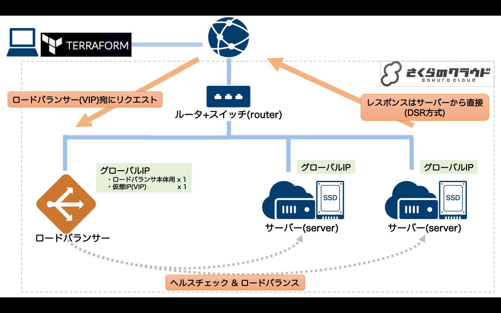

# Terraform for さくらのクラウド ハンズオン

## 応用リソース(アプライアンス)編02: ロードバランサ

DSR方式のロードバランサを提供します。

参考: [さくらのクラウド ロードバランサ](http://cloud-news.sakura.ad.jp/load-balancer/)

## 解説

データベースアプライアンスを利用するには、スイッチ+ルータが必要です。  
また、サーバ側でDSR方式に対応する(仮想IP宛のリクエストに応答する)ための設定が必要になります。

今回はプロビジョニングの中でDSR方式対応のための設定を行なっています。

## 動作確認

`terraform output VIP`を実行すると、ロードバランサに割り当てた仮想IPが表示されます。  
仮想IPを確認し、次のURLをブラウザで開いてください。

    http://[仮想IP]/

ロードバランサ配下のいづれかのサーバから応答されます。

## コマンド

* `terraform plan` … 確認
* `terraform apply` … 反映
* `terraform show` … 詳細情報の表示
* `terraform destroy` … 環境の破棄

## 参考資料

- [Terraform for さくらのクラウド:リファレンス - ロードバランサ](https://yamamoto-febc.github.io/terraform-provider-sakuracloud/configuration/resources/load_balancer/)
- [Terraform for さくらのクラウド:リファレンス - スイッチ+ルータ](https://yamamoto-febc.github.io/terraform-provider-sakuracloud/configuration/resources/internet/)

---

Next: [応用リソース(アプライアンス)編03:VPCルータ](../03_vpc_router)