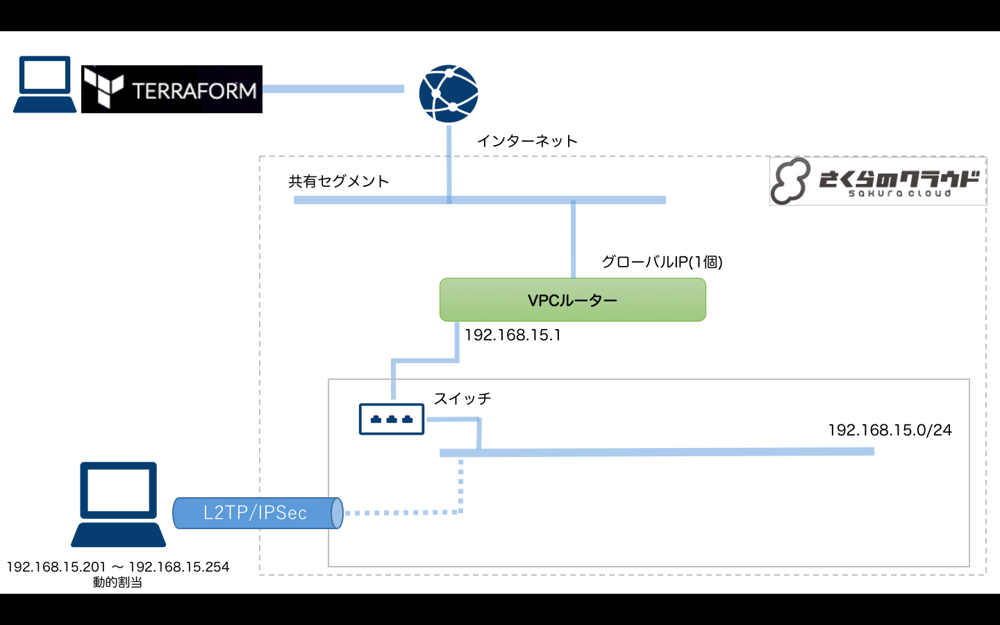

# Terraform for さくらのクラウド ハンズオン

## 応用リソース(アプライアンス)編03: VPCルータ

VPC(Virtual Private Cloud)を構築するためのVPCルータを提供します。

参考: [さくらのクラウド VPCルータ](http://cloud-news.sakura.ad.jp/vpc-router/)

## 解説

今回はVPCルータの持つ機能のうち、VPN機能を利用してL2TP/IPSecでのVPN接続環境を構築しています。

## 動作確認

`terraform apply`実施後、各マシンでVPN接続を行なってください。

## コマンド

* `terraform plan` … 確認
* `terraform apply` … 反映
* `terraform show` … 詳細情報の表示
* `terraform destroy` … 環境の破棄

## 参考資料

- [Terraform for さくらのクラウド:リファレンス - VPCルータ](https://yamamoto-febc.github.io/terraform-provider-sakuracloud/configuration/resources/vpc_router/)

---

Next: [実践編](../../04_advanced/README.md)