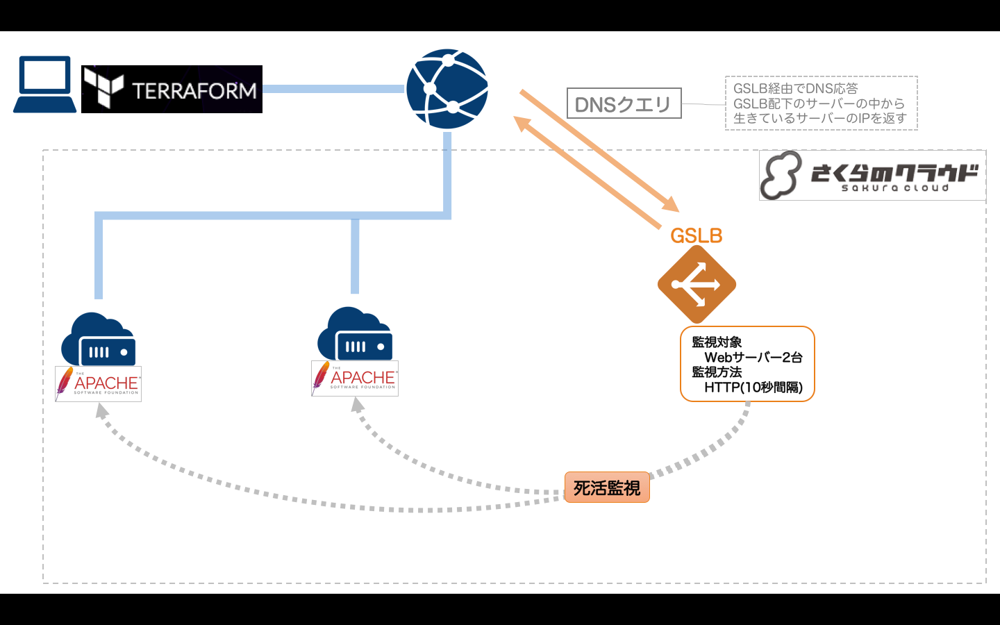

# Terraform for さくらのクラウド ハンズオン

## 実践編01: スケーリング

スケールアップ/ダウン、スケールアウト/インを実習します。



## 解説/ポイント

初期状態では以下のように環境構築されます。

  - サーバ2台
  - 1コア、1GBメモリ

## スケールアップ/ダウン

[terraform.tfvars](terraform.tfvars)を開き、コア数/メモリサイズを変更してください。

```hcl
# サーバスペック
#   指定可能な値は以下のページを参照
#   http://cloud.sakura.ad.jp/specification/server-disk/
server_spec = {
    core = 1     # 2に変更する
    memory = 1   # 4に変更する
}
```

変更後、`terraform apply`を実行することでサーバのスペックが変更されます。

## スケールアウト/イン

[terraform.tfvars](terraform.tfvars)を開き、サーバ数を変更してください。

```hcl
# サーバ数(GSLBを利用する場合は1~6)
server_count = 1   # 2~6に変更
```

変更後、`terraform apply`を実行することでサーバが指定台数まで作成/削除されます。  
サーバ数を変更すると、GSLBへのサーバ登録情報も変更されます。

## 動作確認

`terraform output gslb_fqdn`を実行すると、GSLBに割り当てられたFQDNが表示されます。

FQDNを確認し、以下URLをブラウザで開いてください。

    http://[表示したFQDN]

GSLB配下のサーバから応答されます。  

## DNSキャッシュのクリア(chromeのみ)

通常、ブラウザはDNSキャッシュを持っていますので、リロードしても応答するサーバが変わらないことがあります。  
この場合、以下の手順でDNSキャッシュをクリアすることで、GSLBが応答した別のサーバに接続することが可能です。

以下ページを開き、`Clear host cache`ボタンをクリック

> [chrome://net-internals/#dns](chrome://net-internals/#dns)

## コマンド

* `terraform plan` … 確認
* `terraform apply` … 反映
* `terraform show` … 詳細情報の表示
* `terraform destroy` … 環境の破棄

---

Next: [実践編02: マルチプロバイダ(さくらのクラウド+Arukas)](../02_multi_provider)