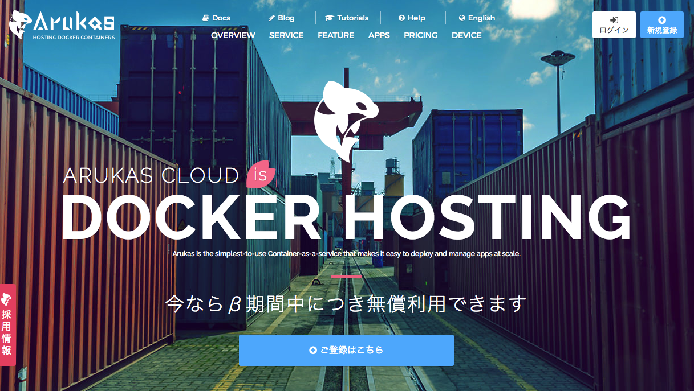

# Terraform for さくらのクラウド ハンズオン

## 実践編02: マルチプロバイダ(さくらのクラウド+Arukas)

複数のプロバイダを利用する構成です。

## 解説/ポイント

今回は[Arukas](https://arukas.io)とシンプル監視を組み合わせています。

あらかじめArukasのアカウント作成/APIキーの作成を行っておく必要があります。  
ArukasのAPIキーは以下の環境変数に設定してください。

   - ARUKAS_JSON_API_TOKEN
   - ARUKAS_JSON_API_SECRET

## コマンド

* `terraform plan` … 確認
* `terraform apply` … 反映
* `terraform show` … 詳細情報の表示
* `terraform destroy` … 環境の破棄

---

Next: [実践編03: ロードバランサ + セキュアなDB接続環境 + VPC](../03_secure)