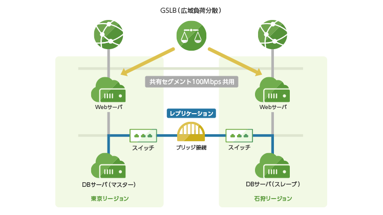

# Terraform for さくらのクラウド ハンズオン

## 実践編03: ロードバランサ + セキュアなDB接続環境 + VPC

以下のリソースを組み合わせることで、セキュアなDB接続環境を構築します。  
サーバ群は東京/石狩で冗長化された構成となります。

- GSLB
- ロードバランサ
- VPCルータ
- スイッチ
- ブリッジ
- サーバ(Web2台、DB2台)

参考: [Terraform for さくらのクラウド スタートガイド （第五回）〜サービス提供用のリソースと応用編〜](http://knowledge.sakura.ad.jp/knowledge/8581/)

## 解説/ポイント

DBのプロビジョニング(インストールやレプリケーション設定など)は省略しています。  

## コマンド

* `terraform plan` … 確認
* `terraform apply` … 反映
* `terraform show` … 詳細情報の表示
* `terraform destroy` … 環境の破棄

---

Next: [実践編04: Docker + NGINX proxyによるマルチテナントCMS](../04_drupal)