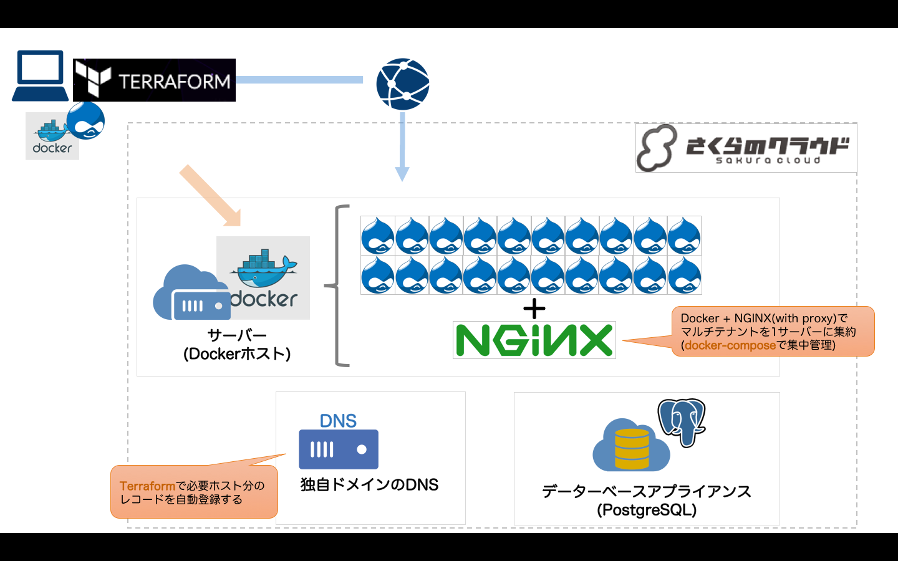

# Terraform for さくらのクラウド ハンズオン

## 実践編04: Docker + NGINX proxyによるマルチテナントCMS

Docker + NGINX proxyによるマルチテナントCMSを構築します。




## 準備

[variables.tf](variables.tf)に稼働させるドメインを記述してください。

```hcl
# DNSゾーン名
variable dns_target_zone { default = "example.com" }
```

また、[docker-compose.yml](drupal-settings/docker-compose.yml)にDrupalを稼働させるホスト名(FQDN)を定義しておく必要があります。

## 解説/ポイント

CMSはDrupalを利用しています。構成は以下の通りです。

  - サーバを1台作成し、Dockerをインストール  
  - データベースアプライアンス(PostgreSQL)上にあらかじめ20ホスト分のDBを作成しておく
  - [docker-compose.yml](drupal-settings/docker-compose.yml)にDrupalを稼働させるホスト名(FQDN)を定義しておく(nginx-proxy用)
  - Dockerでnginx-proxyとDrupalを`docker-compose`を使って起動


## コマンド

* `terraform plan` … 確認
* `terraform apply` … 反映
* `terraform show` … 詳細情報の表示
* `terraform destroy` … 環境の破棄

---

Next: [実践編05: Nomad/Consul/NGINXによるスケーラブルなコンテナホスティング](../05_container_hosting)