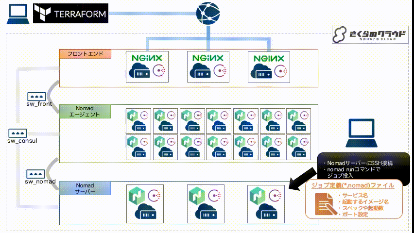
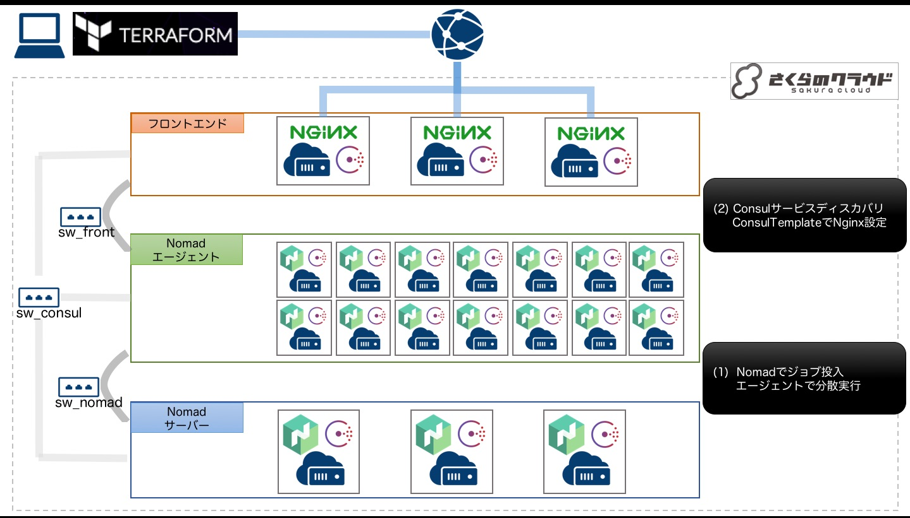

# Terraform for さくらのクラウド ハンズオン

## 実践編05: Nomad/Consul/NGINXによるスケーラブルなコンテナホスティング

参考記事：[Qiita:Nomad/Consul/Nginxでスケールアウト出来るコンテナホスティング環境 on さくらのクラウド](http://qiita.com/items/fa4b3dca54dfebb36973)

## 概要

さくらのクラウド上に以下の環境を構築します。

  - [Nomad](https://www.nomadproject.io)
  - [Consul](https://www.consul.io)
  - [ConsulTemplate](https://github.com/hashicorp/consul-template)
  - [Nginx](http://nginx.org)



[Nomad](https://www.nomadproject.io)でジョブを投入することで、
Nginxのリバースプロキシ設定が自動で行われます。
これにより、nomadで起動したDockerコンテナの(自動割り当てされた)ポート番号を意識することなく
サービス提供が行えるようになります。

また、必要に応じて各役割のマシンをスケールアウトすることもできます。
Nomadのジョブ投入をCIに組み込むなど活用方法はいろいろです。


## 内部動作

Nomadでジョブを実行すると以下のような処理が行われます。

  - nomadサーバーがエージェントへジョブ割り振り
  - nomadエージェントがジョブ実施
  - nomadエージェントで自動割り当てされたポートをConsulに登録
  - ConsulTemplateでNginxのコンフィグファイルを生成、再読み込み(エンドポイント)

例えば、対象ドメインを`nomad.example.com`、サービス名を`apache`とした場合、
Nginxにて`http://apache.nomad.example.com/`というURLでアクセスすると
nomadエージェントで実行されているジョブへリバースプロキシされます。
また、nomadエージェントのグローバルIP/ポートを直接指定することでもアクセス可能です。



## 使い方

### 準備(設定ファイル取得/対象ドメインの設定)

各種設定項目は`variables.tf`ファイルに記載されています。
上記ファイルを編集し、先頭付近の`target_domain`の定義を以下のように編集します。
`YOUR_DOMAIN`の部分を任意のドメインに置き換えてください。
(編集しなかった場合、terraformコマンド実行時に入力することになります)
ここで指定したドメインのサブドメインが自動で割り当てられます。

```variables.tf
variable "target_domain" { 
    defautl = "YOUR_DOMAIN"
}
```


その他の項目は必要に応じて編集してください。


### 構築

#### Terraformでの構築

Terraformでインフラの構築を行います。

```bash:Terraform実行
# Terraformで構築される内容の確認
$ terraform plan

# 構築
$ terraform apply
```

## Nomadでのジョブ実行

### 1) NomadサーバーへSSH接続
SSHでNomadサーバーを実行しているマシンにログインしジョブ投入します。
`terraform output server_global_ip`を実行するとNomadサーバーのIPアドレスが表示されます。  
以下のようにしてSSH接続を行います。

```bash:nomadサーバーへのSSH接続
$ ssh root@[表示されたIPアドレス]
```

### 2) ジョブ定義

サンプルジョブが`~/nomad_sample`に格納されています。
これをコピーしてジョブ定義を行います。
(もちろん自分でジョブ定義を記載しても構いません)

```bash:ジョブ定義
$ cp ~/nomad_sample/apache.nomad ./
```

サンプルではDockerHubからApacheイメージを取得して実行しています。
必要に応じてジョブ定義ファイルを編集してみてください。

サービス定義(job->group->task配下)が規約に沿って行われていれば
自動でフロントエンドにリバースプロキシ設定が行われます。
（サービス定義の規約は[こちら](#nomadサービス定義)を参照）

### 3) ジョブ実行

作成したジョブ定義ファイルを使ってジョブを実行してみます。

```bash:nomadジョブ実行
$ nomad run apache.nomad
```

ジョブの稼働状況の確認は以下コマンドなどで行います。

  - `nomad status` : 実行されているジョブ一覧表示
  - `nomad status [ジョブ名]` : 実行されているジョブの詳細確認

あとは`http://[定義したサービス名].[対象ドメイン]/`にブラウザなどアクセスすれば表示されるはずです。
例：対象サービス名が`service01`、対象ドメイン名が`fe-bc.net`の場合、`http://servic01.nomad.fe-bc.net`にアクセスすればOK

# リファレンス

## インフラ定義(variables.tf)

Terraformでのインフラ定義設定は`variables.tf`ファイルに記載されています。

スペックなど必要に応じて変更してください。


## nomadサービス定義

通常の[nomadでのサービス定義](https://www.nomadproject.io/docs/jobspec/servicediscovery.html)に加え、以下2項目が重要です。

### `name`

サービス名です。この値でエンドポイントを割り当てます。
例：サービス名が`service01`、対象ドメイン名が`nomad.example.com`の場合、エンドポイントは`http://service01.nomad.example.com`となる。

同名のサービスがすでに定義されている場合、フロントエンドNginxにてラウンドロビンされます。


### `tags`

サービス定義部分で`nomad-worker`というタグを付与してください。
このタグが付与されたサービスのみフロントエンドNginxへのリバースプロキシ設定反映の対象となります。

### 記載例

```定義例
service {
	name = "service01"      # ここの名前がサービス名となります。
	tags = ["nomad-worker"] # !!ここがポイント!!
	port = "http"
	check {
		name = "alive"
		type = "tcp"
		interval = "10s"
		timeout = "2s"
	}
}

```

